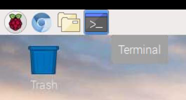
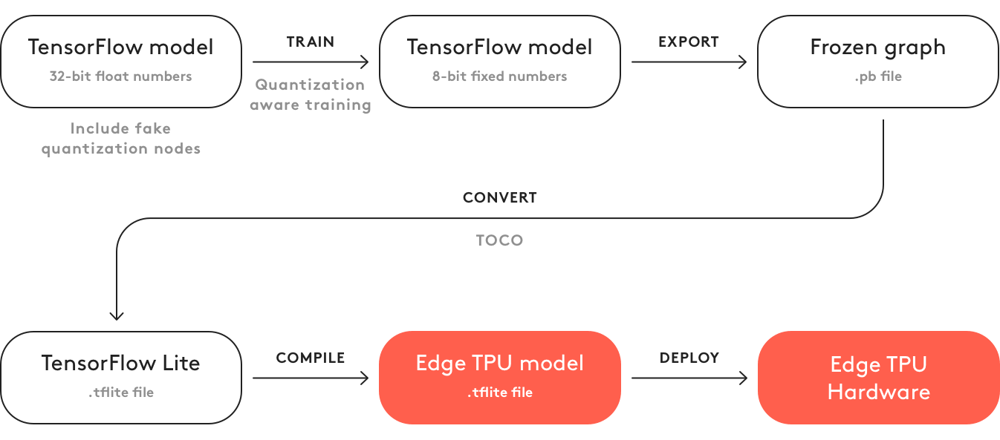
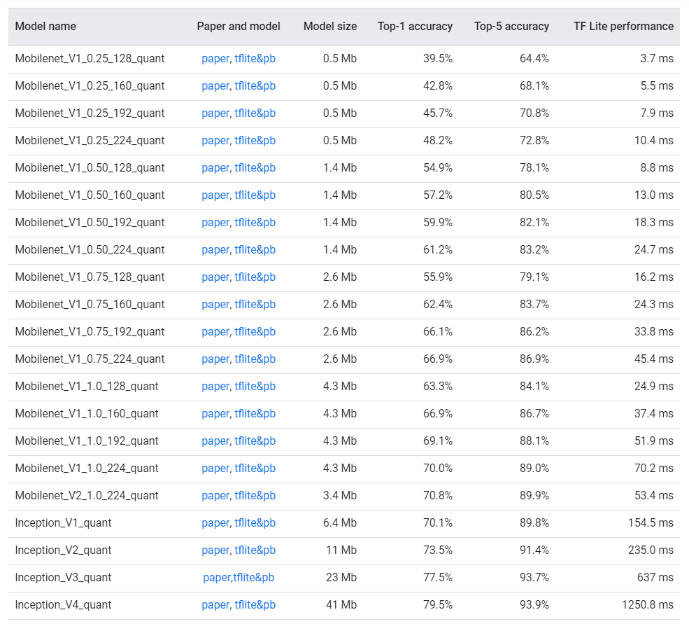

# Module 3: Model Deployment with IoT
## Overview
This module walks through a process in deploying and using a machine learning model inside an IoT prototype board (i.e. Raspberry Pi with Coral Accelerator).

## What you'll learn
In this lab, you will learn how to do the following:
- Prepare the model so it can be used inside an IoT prototype board (i.e. Raspberry Pi).
- Converting to and using an Edge TPU model 
- Integrating with Camera and SenseHat

## Prerequisites

### Skills
- Basic proficiency in Python

### Equipment/Software
- Raspberry Pi Model 3 (available at the test stations)
- Coral Accelerator (available at the test stations)

## Task 01: Prepare Workspace
Note: This assumes you have now access to the prepared raspberry pi setup.
1. Open the terminal    

2. Create a temporary workspace by executing the following in the terminal:
```
rm -rf /home/pi/edgeiot_workspace && 
mkdir /home/pi/edgeiot_workspace && 
cd /home/pi/edgeiot_workspace
```
3. Clone the workshop repository by running the command below:
```
git clone https://github.com/bigdatasg/ai_from_data_to_device.git &&
cd /home/pi/edgeiot_workspace/ai_from_data_to_device/coral_workshop
```

## Task 02: Compile Tensorflow Lite models for the Edge TPU
The following illustrates the basic process to create a model that's compatible with the Edge TPU. Most of the workflow uses standard TensorFlow tools. Once you have a TensorFlow Lite model, you then use our Edge TPU compiler to create a .tflite file that's compatible with the Edge TPU. You can read more about running tensorflow models on edge TPU [here](https://coral.withgoogle.com/docs/edgetpu/models-intro/). The next step below starts from an already converted tensorflow lite model.


1. Run the following to see the available tensorflow lite model files in our folder:    
```
ls test_data/*quant.tflite
```

2. Open the web compiler (https://coral.withgoogle.com/web-compiler/) in the browser and upload the following tensorflow lite model files. Compile them 1 at a time. Follow the steps on the site on how to upload.
```
test_data/mobilenet_v1_0.25_128_quant.tflite
test_data/inception_v4_299_quant.tflite
```
Download the compiled models. 

3. Move the downloaded files to the following folder:
```
/home/pi/edgeiot_workspace/ai_from_data_to_device/coral_workshop/test_data
```
4. You should see 2 edgetpu model files when you run the following command
```
ls /home/pi/edgeiot_workspace/ai_from_data_to_device/coral_workshop/test_data/*v{1,4}*edgetpu.tflite
```

## Task 03: Classify images using the compiled Edge TPU models
1. Ensure you're back to the workspace folder:
```
cd /home/pi/edgeiot_workspace/ai_from_data_to_device/coral_workshop
```
2. Run the following command to classify image using mobilenet:
```
python3 classify_image.py --model test_data/mobilenet_v1_0.25_128_quant_*_edgetpu.tflite --label test_data/imagenet_labels.txt --image images/cat-image.jpg    
```

3. Run the following command to classify another image using mobilenet:
```
python3 classify_image.py --model test_data/mobilenet_v1_0.25_128_quant_*_edgetpu.tflite --label test_data/imagenet_labels.txt --image images/merlion-park-tower.jpg
```    
Does this look like a missile to you?    

4. Run the following command to classify the same image using inception:
```
python3 classify_image.py --model test_data/inception_v4_299_quant_*_edgetpu.tflite --label test_data/imagenet_labels.txt --image images/merlion-park-tower.jpg
```    
Inception got the water part (fountain) right. We got the models from here: https://www.tensorflow.org/lite/guide/hosted_models#quantized_models


Notice how the models vary in terms of Model size, Accuracy, and performance.

## Task 04: Perform transfer learning on Edge TPU
1. Download dataset by running the following:
```
DEMO_DIR=/tmp
```
```
wget -P ${DEMO_DIR} http://download.tensorflow.org/example_images/flower_photos.tgz
```
```
tar zxf ${DEMO_DIR}/flower_photos.tgz -C ${DEMO_DIR}
```
2. Download an embedding extractor:
```
wget -P ${DEMO_DIR} https://dl.google.com/coral/canned_models/mobilenet_v1_1.0_224_quant_embedding_extractor_edgetpu.tflite
```
3. Start on-device transfer learning
```
python3 classification_transfer_learning.py --extractor ${DEMO_DIR}/mobilenet_v1_1.0_224_quant_embedding_extractor_edgetpu.tflite --data ${DEMO_DIR}/flower_photos --output ${DEMO_DIR}/flower_model.tflite --test_ratio 0.95
```

4. Verify that the transfer-learned model works by running it through the classify_image.py script.
```
# Download a rose image from Open Images:
wget -O ${DEMO_DIR}/rose.jpg https://c2.staticflickr.com/4/3062/3067374593_f2963e50b7_o.jpg
```    

```
python3 classify_image.py --model ${DEMO_DIR}/flower_model.tflite --label ${DEMO_DIR}/flower_model.txt --image  ${DEMO_DIR}/rose.jpg
```

You should have the following similar results:    
```
---------------------------
roses
Score :  0.22265625
---------------------------
tulips
Score :  0.20703125
---------------------------
sunflowers
Score :  0.1953125
```
## Task 05: Use the compiled tensorflow lite edgetpu models for image classification    
1. Ensure that webcam is connected to the raspberry pi
2. Run the following (using inception):
```
python3 coral_live_image_classification.py --model test_data/inception_v4_299_quant_*_edgetpu.tflite --label test_data/imagenet_labels.txt
```
Show some objects to the camera.    
The SenseHat on the Pi will display 'D' if it detects something. Otherwise, it will display 'X'.    
Is it fast enough to classify images from the video stream?

Press ctrl+c in the terminal to end the live classification.    
How many FPS did you get?

3. Run the following (using mobilenet):
```
python3 coral_live_image_classification_sensehat.py --model test_data/mobilenet_v1_0.25_128_quant_*_edgetpu.tflite --label test_data/imagenet_labels.txt
```
Show some objects to the camera.  
How fast is it compared to the inception model?    
Press ctrl+c in the terminal to end the live classification.    
How many FPS did you get?      

4. Reset the SenseHat
```
python3 clear_sensehat.py
```

## Task 06: Use pre-trained object detection model
1. Run the following:
```
python3 coral_live_object_detection.py --model test_data/mobilenet_ssd_v2_coco_quant_postprocess_edgetpu.tflite --label test_data/imagenet_labels.txt
```
2. Show the camera some objects to identify
3. Once done, press ctrl+c in the terminal to end the live detection.

## Congratulations! You've completed the Coral EdgeTPU (IoT) Workshop!


